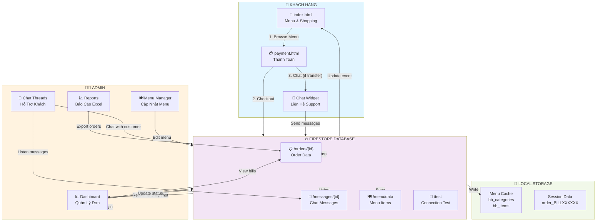
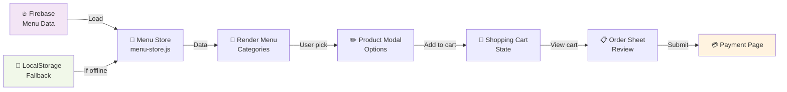
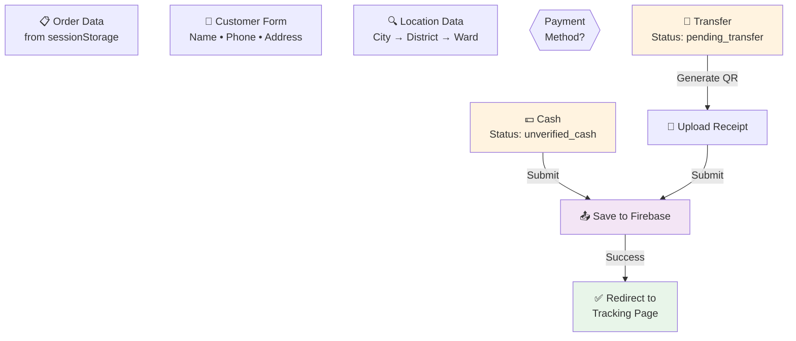
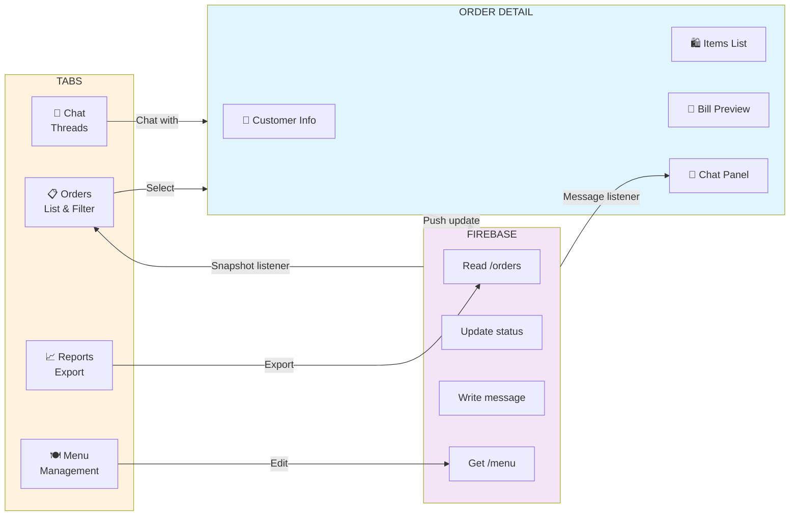
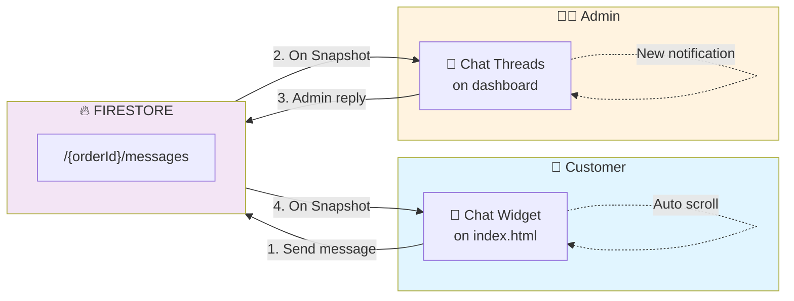
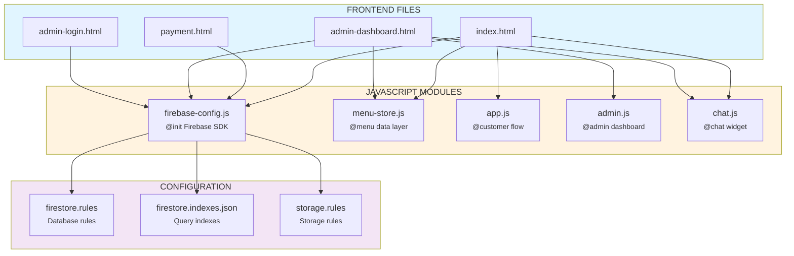
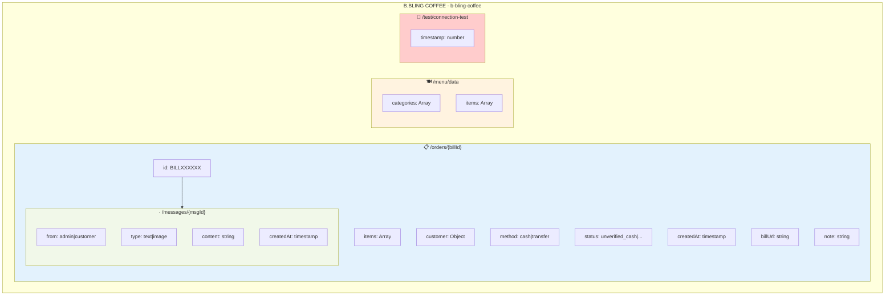

# Sơ Đồ Kiến Trúc B.BLING

## Sơ Đồ Luồng Dữ Liệu



## Sơ Đồ Chi Tiết Các Trang

### 🏠 Trang Khách (index.html)


### 💳 Trang Thanh Toán (payment.html)


### 📊 Dashboard Admin (admin-dashboard.html)


## Sơ Đồ Trạng Thái Đơn Hàng

```mermaid
stateDiagram-v2
    [*] --> Create: Customer<br/>Submit Order
    
    Create --> CashDecision{Payment<br/>Method?}
    
    CashDecision -->|Cash| Unverified: Status:<br/>unverified_cash
    CashDecision -->|Transfer| Pending: Status:<br/>pending_transfer
    
    Unverified -->|Admin Approve| Processing: Status:<br/>processing
    Pending -->|Admin Verify| Processing
    
    Processing -->|Admin Complete| Completed: Status:<br/>completed
    Completed --> [*]
    
    Unverified -->|Admin Cancel| Canceled: Status:<br/>canceled
    Pending -->|Admin Cancel| Canceled
    Processing -->|Admin Cancel| Canceled
    Canceled --> [*]
    
    Unverified -->|Admin Fail| Failed: Status:<br/>failed
    Pending -->|Admin Fail| Failed
    Processing -->|Admin Fail| Failed
    Failed --> [*]
    
    style Create fill:#e1f5ff
    style Unverified fill:#fff3e0
    style Pending fill:#fff3e0
    style Processing fill:#e3f2fd
    style Completed fill:#e8f5e9
    style Canceled fill:#ffcccc
    style Failed fill:#ffcccc
```

## Sơ Đồ Chat Real-time



## Sơ Đồ Code Architecture



## Sơ Đồ Firestore Collections


